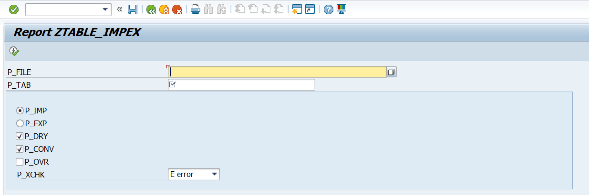
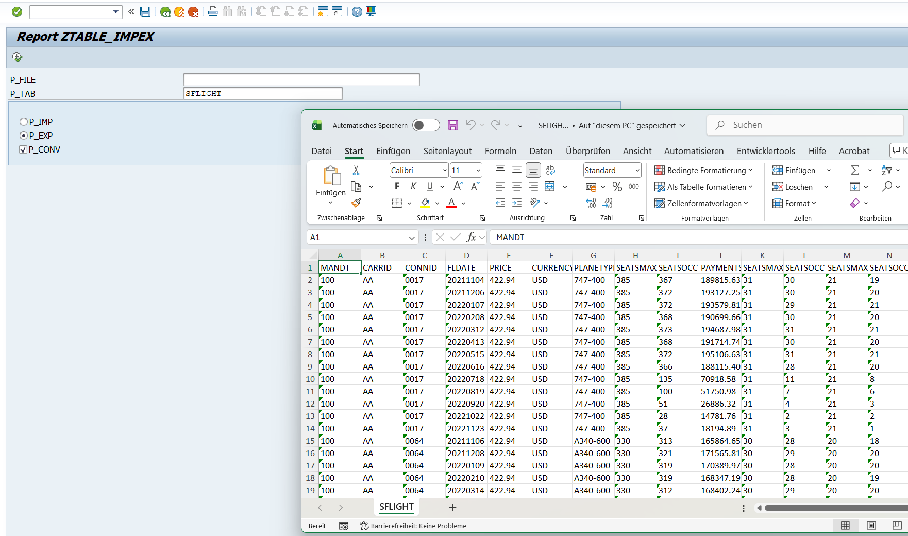
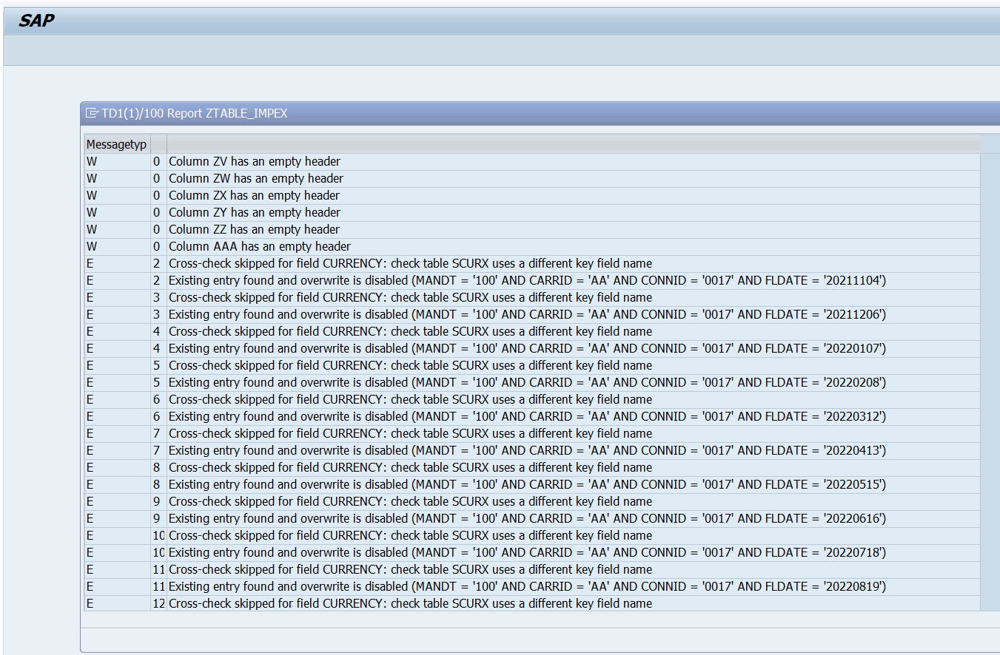

Hey ABAP dev, 

This repo documents my experiments with [Cosine AI](https://www.cosine.sh) and SAP ABAP dated 20260316.

For the exact task description see [TODO.md](TODO.md)

And here are some screenshots of the result:

## Selection screen:

## Selection screen export mode and the resulting table:

## Messages generated from precheck:

A solid base to start iterating, given the sloppy task description I made on the go.

The report code: [ztable_impex.prog.abap](ztable_impex.prog.abap)

# DISCLAIMER

Feel free to download and use **AT YOUR OWN RISK**

I did not check every single functionality of this report, it's a test of AI coding abilities, not a ready product